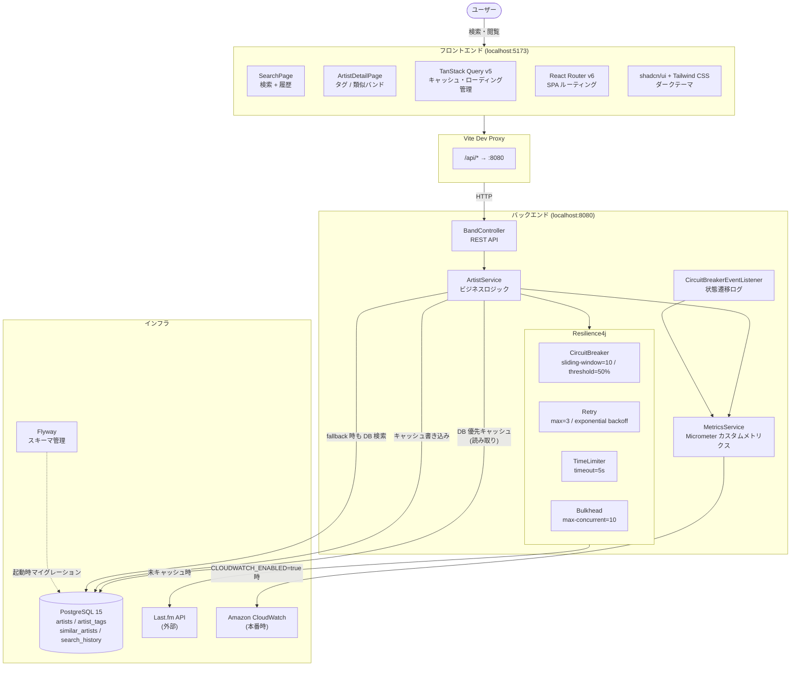
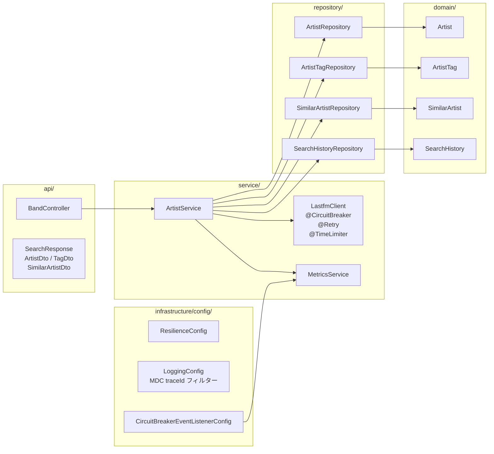
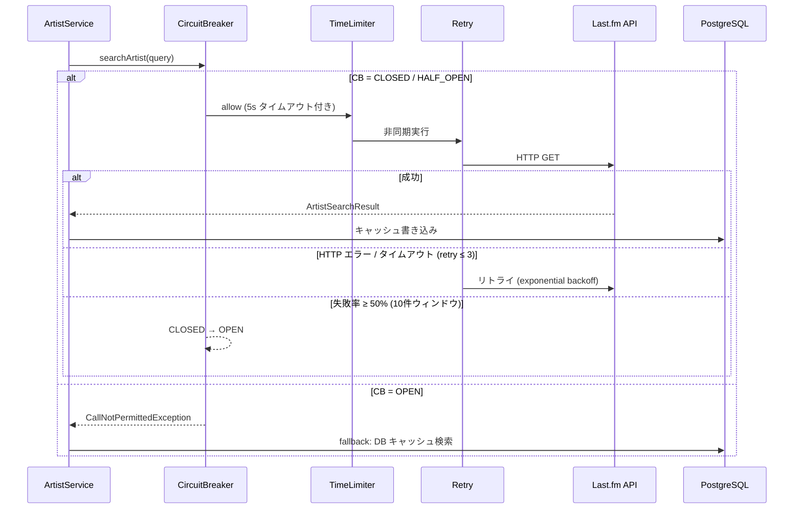
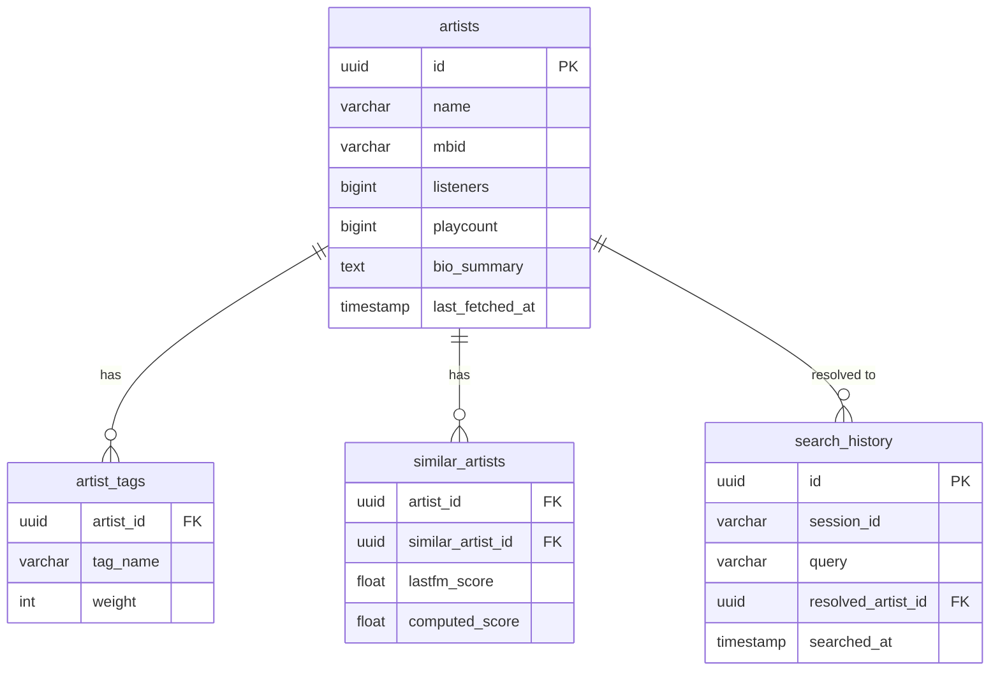

# アーキテクチャ概要

## システム全体図

---

## バックエンド レイヤー構成

---

## Resilience4j パターン（LastfmClient の呼び出しフロー）

---

## データモデル

---

## カスタムメトリクス一覧

| メトリクス名 | 種別 | タグ | 説明 |
|---|---|---|---|
| `lastfm.api.call.total` | Counter | `method`, `status=success\|failure` | Last.fm API 呼び出し回数 |
| `lastfm.api.latency` | Timer (Histogram) | `method` | API レイテンシ分布 |
| `artist.cache.hit` | Counter | `source=db\|api` | キャッシュヒット元 |
| `circuitbreaker.state` | Gauge | `name=lastfmApi` | CB 状態 (0=CLOSED / 1=OPEN / 2=HALF_OPEN) |

CloudWatch カスタム名前空間: **`MetalExplorer`**（`CLOUDWATCH_ENABLED=true` で有効）
